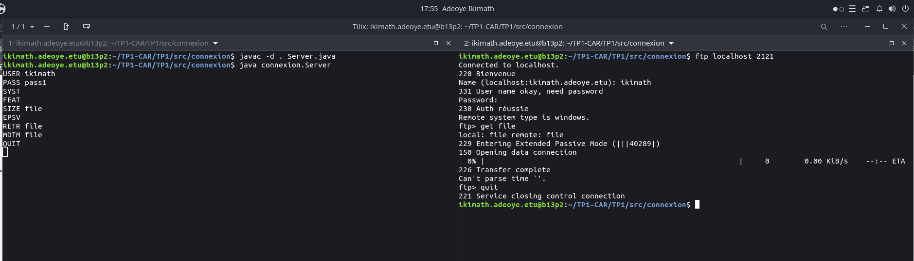

## TP1-CAR
Dépôt pour le Tp1 de Conception d'applications réparties
Serveur FTP en Java

# Description du projet

Ce projet est une implémentation d'un serveur FTP en Java, permettant aux clients de se connecter, de s'authentifier et d'effectuer certaines opérations de base telles que la récupération de fichiers.

# Fonctionnalités implémentées

**Connexion et authentification et Récupération de fichier**

Le serveur écoute sur le port 2121 et accepte les connexions entrantes.
L'authentification est basée sur une liste d'utilisateurs prédéfinie.
Si les identifiants sont valides, l'utilisateur peut envoyer des commandes FTP.

**Commandes FTP prises en charge**

- USER : <nom_utilisateur> : Permet de spécifier un nom d'utilisateur pour l'authentification.
- PASS : <mot_de_passe> : mot de passe de l'utilisateur
- SYST : Renvoie le type de système d'exploitation du serveur.
- FEAT : Indique la fin de la liste des fonctionnalités.
- SIZE <fichier> : Renvoie la taille d'un fichier spécifique.
- EPSV : Active le mode passif étendu pour le transfert de fichiers.
- RETR <fichier> ou GET <fichier> : Permet de télécharger un fichier depuis le serveur
- MDTM : Retourne la date de dernière modification d'un fichier.
- QUIT : Ferme la connexion entre le client et le serveur FTP


# Instructions d'utilisation

Compilation et exécution
Se placer dans src/connexion puis:

```
javac -d . Server.java
java connexion.Server
```
Connexion via FTP

```
ftp localhost 2121
```

# Exemple démo:


